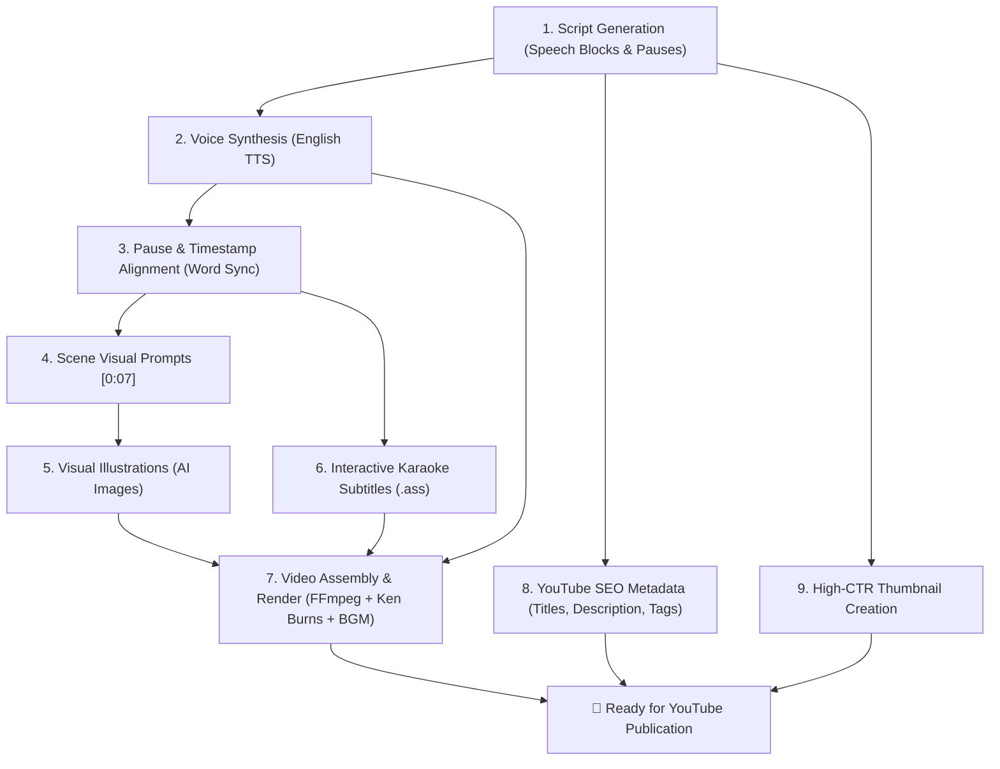

# 🎬 YouTube AI Video Studio — High Retention Video Creation Pipeline

An autonomous, full-stack video creation studio engineered to generate **high-retention**, **monetization-compliant** videos for YouTube Shorts (9:16) and YouTube Long-form (16:9).

---

## 🌟 Key Highlights & YouTube Compliance

YouTube's algorithm and partner program have strict rules regarding AI-generated content. This studio adheres directly to high-quality production standards:

1. **⚡ 3-Second Hook & Structured Pacing**: Scripts are divided into speech blocks with intentional pauses to maintain viewer watch time.
2. **🎥 Continuous Visual Motion (Ken Burns Effect)**: Eliminates static slideshow penalties through dynamic zoom-ins, zoom-outs, and smooth camera panning.
3. **🎙️ Natural Voice Narration & Word-Level Alignment**: Expressive English neural voices synchronized to fractional-second pause detection.
4. **📝 Interactive Karaoke Subtitles (ASS Highlight)**: High-impact Hormozi / TikTok style subtitles that illuminate words as they are pronounced.
5. **🎵 Audio Mixing with Auto-Ducking**: Background music is automatically ducked (-18dB) underneath speech for a professional sound stage.
6. **📦 High-CTR Metadata & Thumbnails**: Click-worthy titles, SEO descriptions, tags, and vibrant thumbnails generated automatically.

---

## 🗺️ The 9-Step Production Pipeline



---

## 🚀 Quick Start

### 1. Requirements
- **Python 3.11+**
- Packages: `fastapi`, `uvicorn`, `edge-tts`, `imageio-ffmpeg`, `pillow`, `pydub`, `httpx` (installed automatically).

### 2. Launch the Studio
```bash
python run.py
```

Open your browser and navigate to:
- **Studio Interface**: [http://localhost:8000](http://localhost:8000)
- **Interactive API Docs**: [http://localhost:8000/docs](http://localhost:8000/docs)

---

## 🎛️ Modes of Operation

### 1. Step-by-Step Interactive Studio
Gives creators full control over every single stage:
- **Step 1**: Write or refine the script with pause breaks.
- **Step 2 & 3**: Listen to the voice narration and inspect automatically segmented scenes.
- **Step 4 & 5**: Edit individual visual prompts and regenerate specific scene images.
- **Step 6**: Customize subtitle styling (`Hormozi`, `High Energy`, `Documentary Minimalist`).
- **Step 7**: Choose background music and render with real-time video preview.
- **Step 8 & 9**: Copy viral titles, SEO description, tags, and download the high-CTR thumbnail.

### 2. ⚡ 1-Click Auto-Pilot
Type a single topic (e.g. *"The Unexplained Bloop Sound"*), choose your format and voice, and press **Launch Complete 1-Click Video Production**. The studio runs all 9 steps autonomously in the background with a real-time progress bar and live terminal log stream.

---

## 🏗️ Architecture & Project Structure

```
prj1/
├── run.py                           # Single-command launcher
├── test_pipeline.py                 # Automated 9-step pipeline test suite
├── backend/
│   ├── app/
│   │   ├── main.py                  # FastAPI server with REST & Static endpoints
│   │   ├── config.py                # System settings, paths & FFmpeg auto-detection
│   │   ├── models/
│   │   │   └── schemas.py           # Pydantic data schemas
│   │   ├── services/
│   │   │   ├── llm_service.py       # Scriptwriting, prompt & SEO engine
│   │   │   ├── tts_service.py       # Neural TTS & boundary extractor
│   │   │   ├── aligner_service.py   # Scene segmenter & pause detector
│   │   │   ├── prompt_service.py    # Per-scene cinematographic visual prompts
│   │   │   ├── image_service.py     # High-res image generation & local cache
│   │   │   ├── subtitle_service.py  # Advanced SubStation Alpha (.ass) karaoke builder
│   │   │   ├── audio_mixer.py       # Speech + BGM mixer with auto-ducking
│   │   │   ├── video_engine.py      # FFmpeg Ken Burns & composition engine
│   │   │   ├── metadata_service.py  # YouTube SEO package generator
│   │   │   └── thumbnail_service.py # High-contrast thumbnail compositor
│   │   └── utils/
│   │       ├── ffmpeg_helper.py     # FFmpeg subprocess & filter chain helpers
│   │       └── file_manager.py      # Project state storage & media URLs
│   └── assets/                      # BGM tracks and fonts
├── frontend/
│   └── static/
│       ├── index.html               # Studio Web Application (Dark Mode + Tailwind CSS)
│       ├── css/style.css            # Glassmorphism styling and animations
│       └── js/
│           ├── api.js               # Backend API client
│           └── app.js               # Reactive Studio UI state controller
└── storage/
    └── projects/                    # Generated video projects and rendered media
```

---

## 🔑 Optional API Keys

The system is designed to work **100% free out-of-the-box** using Edge-TTS and high-speed Flux image synthesis via Pollinations.ai.

If you wish to use your own commercial API keys, you can set them in your environment:
```bash
set OPENAI_API_KEY=your_key_here
set GEMINI_API_KEY=your_key_here
set ELEVENLABS_API_KEY=your_key_here
set FAL_KEY=your_key_here
```

---

## 🧪 Testing

To run the automated 9-step test suite:
```bash
python test_pipeline.py
```
