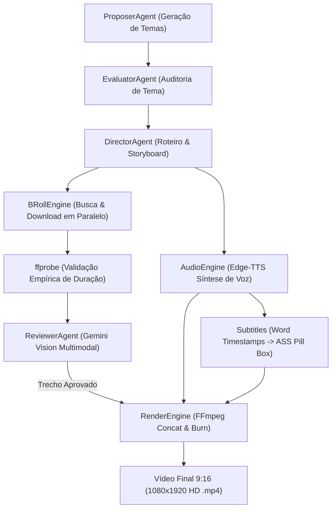

# Referência: Arquitetura Geral do Sistema e Fluxo de Dados

Este documento descreve a topologia completa da plataforma, mapeamento de módulos, fluxo de dados e interfaces de comunicação entre os subsistemas.

---

## 1. Visão Geral da Arquitetura

O sistema é estruturado como um pipeline modular de 5 estágios orquestrado em Python 3.11+:

---

## 2. Mapa Estrutural dos Módulos

| Arquivo / Módulo | Responsabilidade Principal |
| :--- | :--- |
| `app.py` | Interface gráfica Streamlit com painel de produção, controle de concorrência, métricas e alertas de throttling. |
| `agents.py` | Definição dos 4 agentes (`ProposerAgent`, `EvaluatorAgent`, `DirectorAgent`, `ReviewerAgent`), rate limiter e cliente `google-genai`. |
| `broll_engine.py` | Busca e download de mídia (`yt-dlp`), validação de duração (`ffprobe`), recorte 9:16 e varredura temporal com propagação de contexto Streamlit. |
| `audio.py` | Síntese de voz neural multilíngue com Edge-TTS e extração de carimbos de tempo por palavra. |
| `subtitles.py` | Compilador de legendas dinâmicas em formato ASS com destaque de palavra ativa em caixa de realce (*Pill Box*). |
| `render.py` | Orquestrador de composição no FFmpeg (redimensionamento Lanczos, concatenação e queima de legendas). |
| `logger.py` | Sistema centralizado de logs estruturados com telemetria por *spans* e detector de throttling de API e download. |
| `docs/` | Documentação técnica organizada segundo os 4 quadrantes do framework Diátaxis. |

---

## 3. Especificações Técnicas de Saída

- **Resolução:** 1080 x 1920 pixels (Aspect Ratio vertical 9:16 nativo).
- **Taxa de Quadros:** 30 fps constante.
- **Codec de Vídeo:** H.264 (libx264, perfil `high`, CRF 18, `-pix_fmt yuv420p`).
- **Codec de Áudio:** AAC Stereo a 192 kbps, 24000 Hz / 44100 Hz.
- **Taxa de Bits Típica:** 6 a 12 Mbps.
- **Container Final:** MP4 (`.mp4`).
